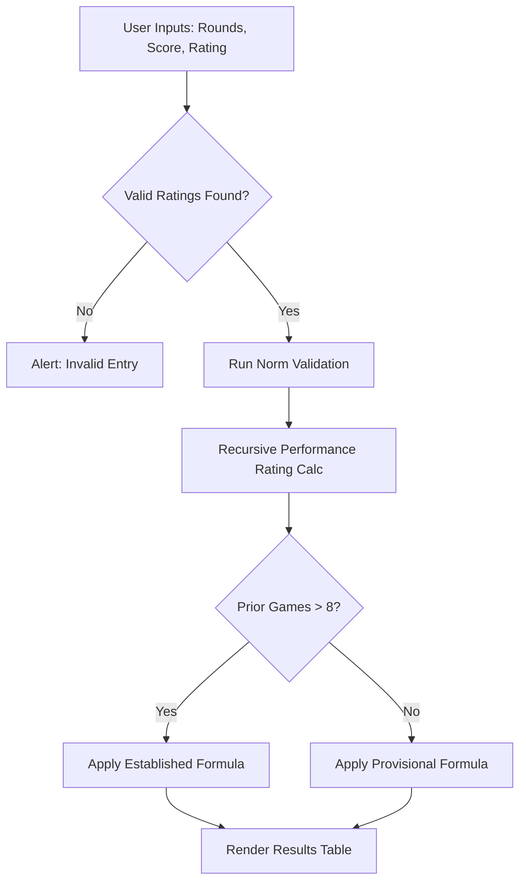

# USCF Rating Estimator
**An algorithmic tool for real-time chess performance analysis and title norm validation.**

   

> **Historical Milestone:** This project was completed in **mid-2023**. It serves as a record of my early transition into complex frontend logic and demonstrates my growth in managing domain-specific mathematical constraints and state-management challenges.

## Video Demo
[Watch the USCF Rating Estimator in Action](https://youtu.be/neblpLsHpbE)

## Motivation & Problem Statement
In United States Chess Federation (USCF) play, ratings are the primary metric for skill estimation and tournament pairing. However, the official USCF ecosystem often presents two significant hurdles for active players:

* **Processing Latency:** Official tournament results are frequently delayed by days or weeks, leaving players in the dark about their updated standing.
* **Missing Features:** The official estimator lacks Norm calculations, which are essentially performance thresholds that must be met 5 times to earn titles like *Candidate Master* or *Life Master*.

This project was engineered to bridge these gaps. It provides an immediate, user-friendly interface for calculating post-event ratings and automated title norm validation. By implementing the mathematical formulas designed by Dr. Mark Glickman, the tool transforms a "black box" calculation into a transparent, real-time dashboard for competitive players.

## Engineering Journey & Technical Progression
The development of this tool followed a path of "progressive refinement," moving through several architectural paradigms as the complexity of the requirements evolved.

### Phase 1: The Python Proof-of-Concept
The project began as a basic command-line utility in Python focused on verifying the fundamental USCF rating formulas. This initial version was purely functional, intended to confirm that I could accurately replicate the standard rating changes for established players before attempting a full web implementation.

### Phase 2: Architectural Pivot (Flask to Vanilla JS)
Initially, I prototyped the web application using Python and Flask. However, I encountered a significant "state-management" challenge: traditional `POST` requests caused page reloads that cleared dynamically generated input fields. To prioritize UI Responsiveness and UX Consistency, I pivoted to a pure Vanilla JavaScript implementation. This shift allowed for:
* **Dynamic DOM Manipulation:** Generating between 1 and 20 round inputs instantly without page refreshes.
* **Client-Side Persistence:** Ensuring user data remains intact even if the number of rounds is adjusted mid-entry.
### Phase 3: Mathematical Integrity & Algorithmic Refinement
In the final stage, I moved beyond basic ratings to implement the most complex parts of the USCF system. This included the recursive "sandwich" method for calculating performance ratings, as well as a comprehensive Title Norm validator. During this phase, I analyzed modern design choices by peers in the chess-tech space to ensure the interface was streamlined, removing some of the clutter from the official tool in favor of features that are important to more users.
## System Logic Flow
This diagram illustrates how the application processes user data, from initial validation through the recursive calculation of performance ratings and norm checks.

## Usage: "Time to Hello World"
To quickly estimate your performance and check for title norms, follow these steps:

1.  **Tournament Overview:** Input the total number of rounds (1–20) and your final score (1 point for a win, 0.5 for a draw).
2.  **Player Context:** Enter your current USCF rating and the number of prior rated games. If you have played fewer than 8 games, the tool will automatically apply the provisional rating formula.
3.  **Opponent Data:** Fill in the dynamically generated rating fields for each round. Valid USCF ratings (100–3000) are required for an accurate calculation.
4.  **Analyze:** Click **"Rate"** to instantly generate a results table showing your New Rating, Performance Rating, and any earned Norms.

## Technical Features & Mathematical Logic
The application’s engine is built on the rigorous standards proposed by Dr. Mark Glickman and adopted by the USCF.

* **Recursive Performance Rating:** For non-perfect scores, the tool uses an iterative "sandwich" method to narrow the gap between expected and actual scores until a precise performance rating is found.
* **Dynamic K-Factor Calculation:** The engine adjusts the "K-factor" (sensitivity of rating change) based on the user's current rating and effective games played.
* **Automated Norm Validation:** The system iterates through multiple title thresholds (from 4th Category Master to Life Senior Master) to determine eligibility based on field strength and score.
* **Responsive State Management:** Built with Vanilla JavaScript to ensure that round-entry fields update dynamically without data loss or page refreshes.

## License
This project is licensed under the **MIT License**. This permissive license allows for commercial use, modification, and distribution, provided that the original license and copyright notice are included.

See the [LICENSE](LICENSE.md) file for the full legal text.